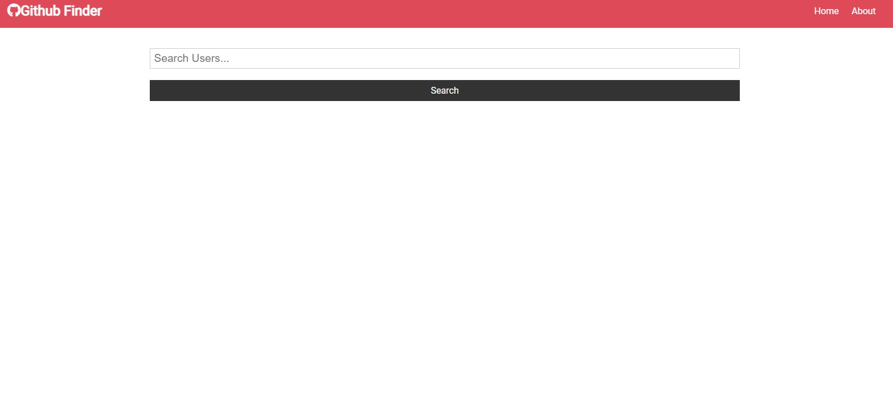
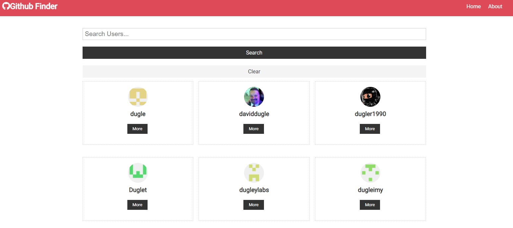
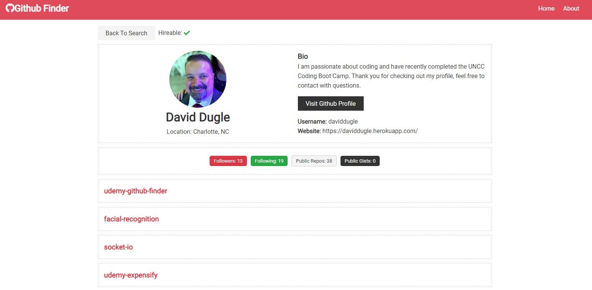

# github finder

### Table of Contents

- [Description](#Description)

- [Installation](#Installation)

- [Technologies](#Technologies)

- [Usage](##Usage)

- [Contributing](#Contributing)

- [Questions](#Questions)

- [Tests](#Tests)

- [Photos](#Photos)

## Description

This is a react app that lets you search github for users and see some of their repos.

## Installation Instructions

<a href='https://enigmatic-lowlands-25408.herokuapp.com/' target='_blank'>visit the deployed site. </a>

## Technologies Used

- list your technologies used in the app

## Usage

The app will show you if a person is hireable along with their contact information.

## Contributing

email

## Questions

I can be reached via Github or email, please see the appropriate links below.

Github:
<a href='https://github.com/daviddugle' target='_blank'>daviddugle</a>

Email:
<a href='mailto:david.dugleii@yahoo.com'>david.dugleii@yahoo.com</a>

## Tests

on the depoloyed site

## Photos

